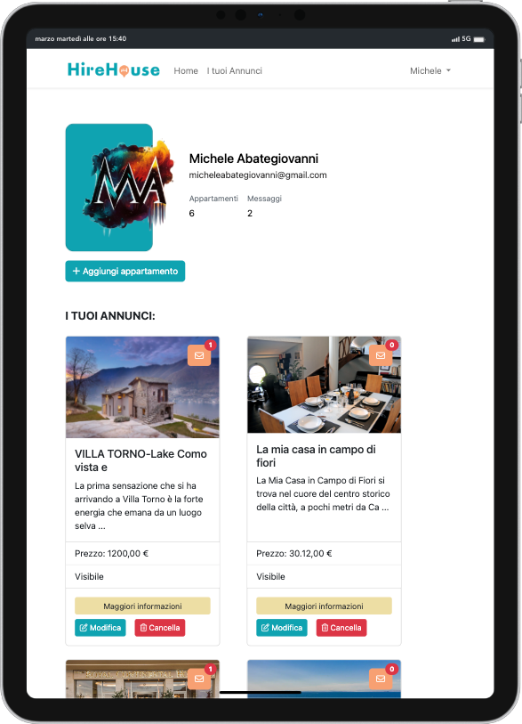
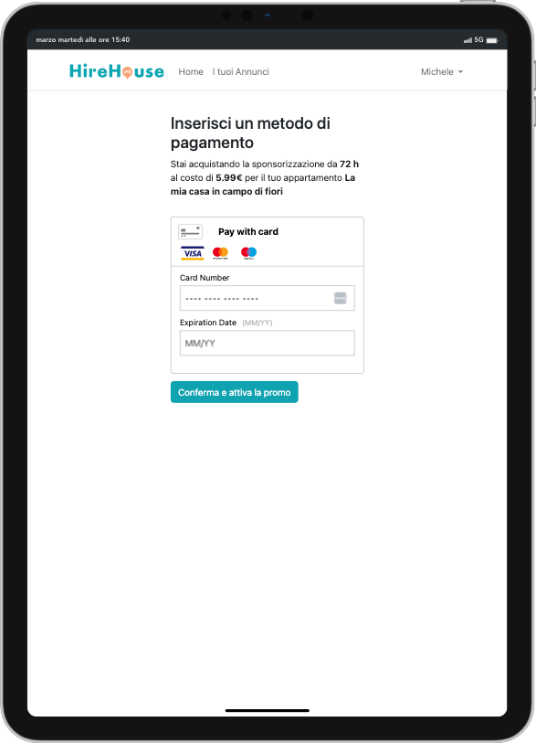
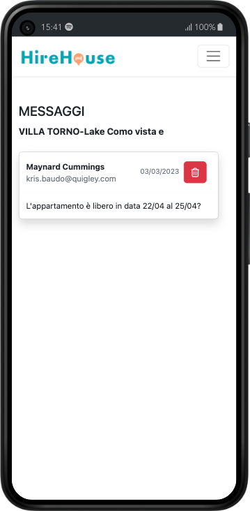

 

 

 
 

# 🏠 <strong>HireHouse - Back-End Project</strong>

<strong>Hirehouse</strong> is a project based on the famous <strong>AirBnb Web App</strong>.  
This project was <strong>made in team</strong>, where you will find the thanks at the bottom, in three weeks of development.  
It was created through an initial analysis of the <strong>DataBase</strong> we wanted to create, and then proceeded to write the code.  
The technologies used were: <strong>PHP</strong>, <strong>Laravel</strong>, <strong>MySQL</strong>, <strong>CSS</strong>, <strong>SASS</strong>, <strong>BootStrap</strong>, <strong>JavaScript</strong>,  <strong>TomTom</strong>,  <strong>Braintree</strong> .  

## <strong>About Project</strong>

This project shows the back-end part of our application, which communicates through <strong>APIs</strong>, to the front-end part.
In the back-end part, we have the possibility of being able to register and possibly insert apartments within our Application.
The main functions that a user can perform are:

-   <strong>Create / Modify / View / Delete</strong> of one or more apartments.
-   <strong>Receipt of messages</strong> from users for each of their apartments, in a <strong>special responsive dashboard</strong>.
-   The possibility of <strong>sponsoring</strong> an apartment for a certain pre-established range of hours.

<strong>Obviously, the application has also been designed above all to make it accessible to the user when navigating through a telephone, tablet or PC</strong>.

 

### <strong>Apartment Management</strong>

When the user logs in, he will be redirected to a dashboard.
The dashboard has been designed to immediately highlight all the user's apartments published, highlighting the main information such as the visibility of the ad and the details of his account, the relative number of apartments published and the messages he has in total.
During the creation or modification of the apartment, the owner user will have the possibility to enter the most used fields, such as, for example, address, price per night, image, services, etc.
In these two phases we will have a form available to fill out, in which the possibility of <strong>writing the address</strong> and having the <strong>TomTom autocomplete</strong> flanked by the map that will mark the exact point has been inserted.
On <strong>all input</strong> fields there will always be a <strong>Client-Side validation</strong> active, to verify that the fields entered by the user are correct and that they can be saved to the DB.  
In the creation phase, if the user does not insert his own photo of the apartment, it will be generated by default.  
The owner of the apartment will also have the possibility to definitively cancel his own apartment from our Application.

 

### <strong>Show</strong>

On the apartment show page, we will have all the information relating to the apartment available, with the addition of three buttons at the top, which are:

-   <strong>Sponsorship</strong>
-   <strong>Edit</strong>
-   <strong>Messages</strong>

The <strong>sponsorship</strong> will redirect us to a page where the owner of the apartment will choose which type of sponsorship to apply to his apartment and once chosen, we will have a checkout page where he will enter his payment card details.
Once the payment has been made and everything will be successful, the user will be brought back to the apartment show where he can effectively view the relative sponsorship applied.
The user cannot carry out more than one sponsorship until the paid one ends.
As soon as the payment has been correctly registered, your apartment will be visible in the front-end part of the Application in the respective positions to give it prominence.

 

 

The <strong>messages</strong> toggle indicates to the user through a notification badge how many messages we have for that apartment.
By interacting with it, you will be directed to a page containing the relative messages received with all the information communicated, ie name, email, content and date of sending.
The possibility of being able to delete a specific message has also been added if the user wishes to do so.

 

 

## <strong>Thanks to❤️</strong>

Last but not least, thanks go to my team, which has always been close-knit and collectively ready for the realization of this project and for solving the various difficulties encountered and the bugs fixed.
Here you will find all their links:

<h3><a href="https://github.com/HelgaToshkollari">Helga Toshkollari</a></h3>
<h3><a href="https://github.com/ManganiBiagio">Biagio Mangani</a></h3> 
<h3><a href="https://github.com/PiersilvioPellegrini">Piersilvio Pellegrini</a></h3> 
<h3><a href="https://github.com/Sofia-Citrini">Sofia Citrini</a></h3>
